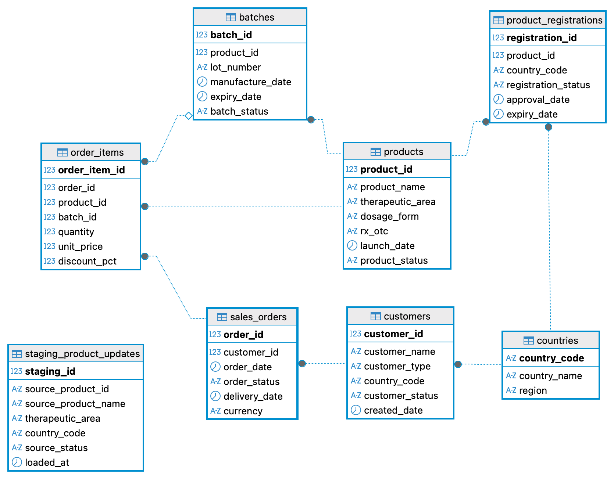

# Pharmaceutical Data Quality Analysis with SQL

## Project Overview

This project demonstrates an SQL-based data quality and data stewardship workflow using a synthetic pharmaceutical database.

The analysis covers database exploration, data profiling, validation, master-data comparison, duplicate and missing-value detection, and exception reporting.

> All company names, product names, and records used in this project are fictional. This project does not contain internal data from any company.

## Project Objectives

- Explore the database structure and table relationships
- Profile pharmaceutical product, customer, order, and batch data
- Identify missing, duplicate, inconsistent, and invalid values
- Compare staging data with master data
- Define and test data-quality rules
- Produce exception reports for data-quality issues
- Practise business-focused SQL queries

## Database

The database contains eight tables:

- `products`
- `countries`
- `customers`
- `sales_orders`
- `order_items`
- `batches`
- `product_registrations`
- `staging_product_updates`

## Entity Relationship Diagram



## Tools

- MySQL 8.0+
- DBeaver
- SQL
- Git and GitHub
- Visual Studio Code

## Repository Structure

```text
pharmaceutical-data-quality-sql/
├── images/
│   └── database_erd.png
├── sql/
│   ├── 00_database_setup.sql
│   ├── 01_data_exploration.sql
│   ├── 02_foundation_queries.sql
│   └── 03_joins_and_business_analysis.sql
├── .gitignore
└── README.md
```

## Current Progress

- [x] Created and imported the synthetic database
- [x] Reviewed the database structure
- [x] Created the entity relationship diagram
- [x] Explored all eight tables
- [x] Identified initial potential data-quality issues
- [x] Completed foundational SQL analysis
- [x] Completed JOIN and business analysis
- [ ] Perform data-quality validation
- [ ] Compare staging data with master data
- [ ] Create the final exception report

## Foundation SQL Topics

The foundational SQL analysis includes:

- Filtering records with `WHERE`
- Combining conditions with `AND` and `IN`
- Sorting results with `ORDER BY`
- Removing duplicate values with `DISTINCT`
- Aggregating records with `COUNT`
- Grouping results with `GROUP BY`
- Calculating date differences with `DATEDIFF`
- Creating date ranges with `DATE_ADD` and `BETWEEN`
- Limiting query results with `LIMIT`

## JOIN and Business Analysis Topics

The JOIN and business analysis section includes:

- Combining customer and country data
- Counting approved product registrations by country
- Identifying products without an approved registration
- Calculating gross and net revenue
- Aggregating delivered revenue by country
- Identifying top customers by net revenue
- Comparing monthly order volumes
- Detecting sales made without an approved product registration
- Detecting mismatches between ordered products and batch products
- Using `INNER JOIN` and `LEFT JOIN`
- Joining tables with multiple matching conditions
- Using `COALESCE` to handle missing values

## Key Data-Quality Areas

The staging dataset intentionally includes examples of:

- Missing values
- Duplicate records
- Invalid product identifiers
- Invalid country codes
- Inconsistent text casing
- Differences between staging and master data

## Project Status

This project is currently in progress.